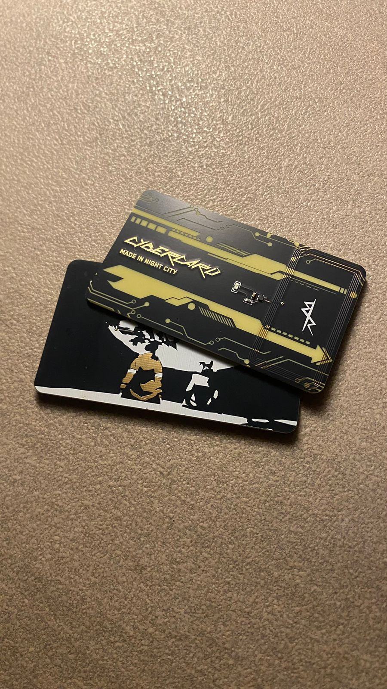

<h1 align="center">
   
  
   
  Cybercard
   
</h1>

<h4 align="center">
A Cyberpunk themed NFC hacker card!
</h4>

  <a href="#key-features">Key Features</a> •
  <a href="#design-process">Design Process</a> •
  <a href="#pcb">PCB</a> •
  <a href="#bom">BOM</a> •
  <a href="#credits">Credits</a> •
  <a href="#license">License</a>

## Key Features

- NFC capability
- Cyberpunk-inspired design with Edgerunners artwork
- Custom PCB layout with NFC antenna
- Sleek card form factor

## Design

The CyberCard features a cyberpunk-inspired design with artwork inspired by the Edgerunners series, including David and Lucy on the moon and the iconic symbol from David's jacket. The design was created in Figma with multiple revisions to achieve the perfect aesthetic.

## PCB

Designed in KiCad. Notable features:

- NFC antenna for contactless communication
- Compact card form factor
- Cyberpunk-themed artwork

### Main Board

(I can pay for most/all of shipping if needed)

## BOM

| Item      | Price (USD) | Source |
| --------- | ----------- | ------ |
| PCB       | 43.16       | JLCPCB |
| **Total** | 43.16       |        |

## Credits

This project uses:

- [KiCad](https://www.kicad.org/)
- [Figma](https://www.figma.com/)

## You may also like...

- [Niveles De Niveles](https://github.com/NotARoomba/NivelesDeNiveles) – Real-time flood alert app
- [Linea](https://github.com/NotARoomba/Linea) – An EMR tablet
- [Tamaki](https://github.com/NotARoomba/Tamaki) – A cute HackPad

## License

MIT

---

> [notaroomba.dev](https://notaroomba.dev) &nbsp;&middot;&nbsp;
> GitHub [@NotARoomba](https://github.com/NotARoomba)
